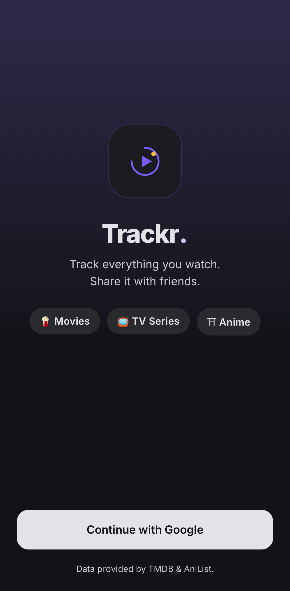
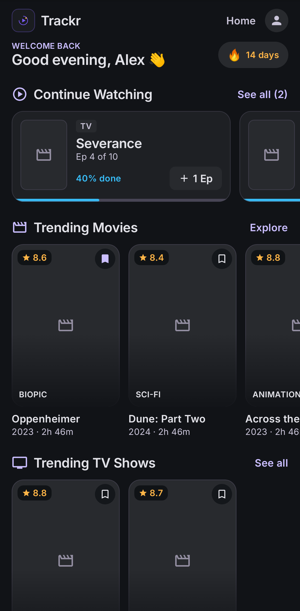
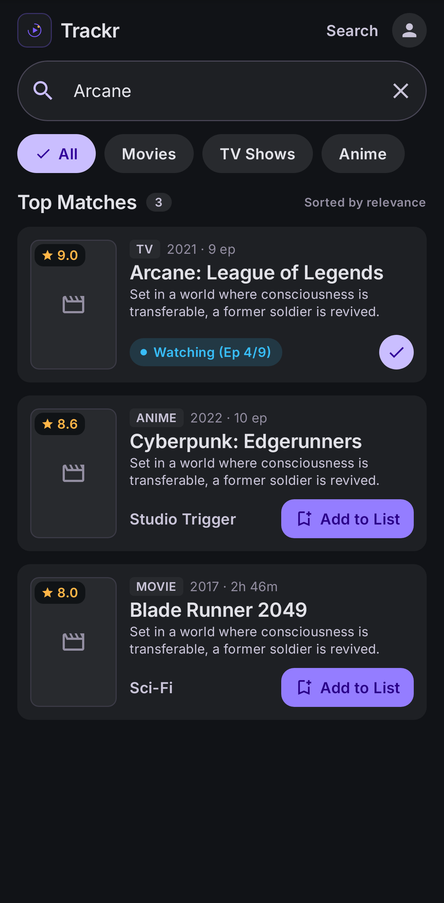
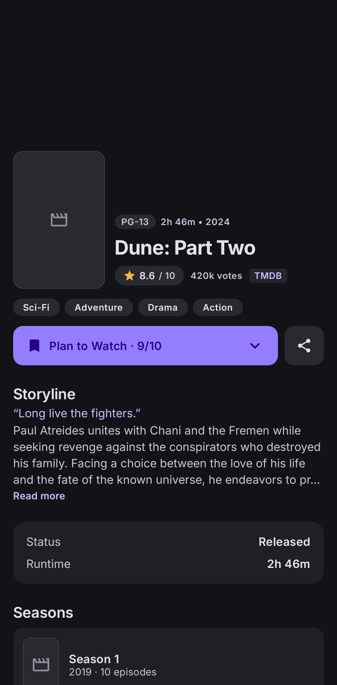
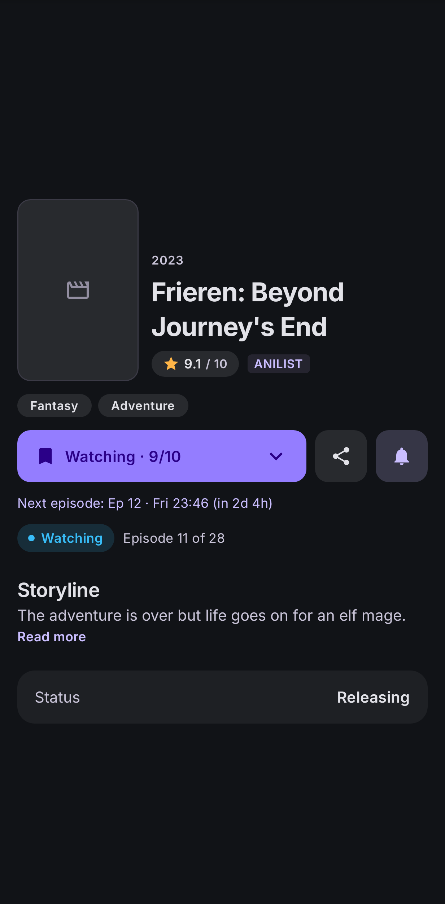
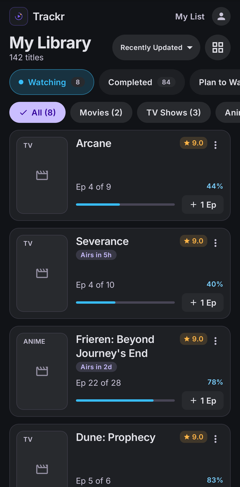
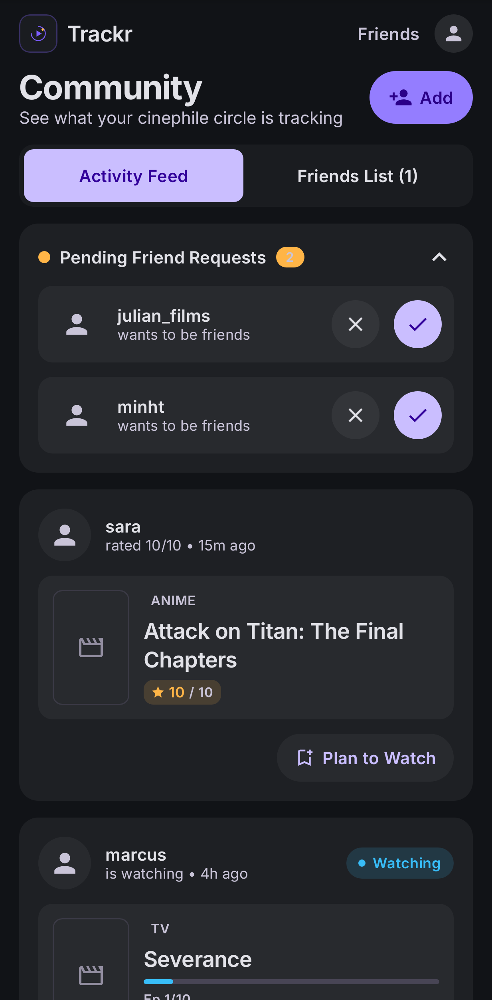
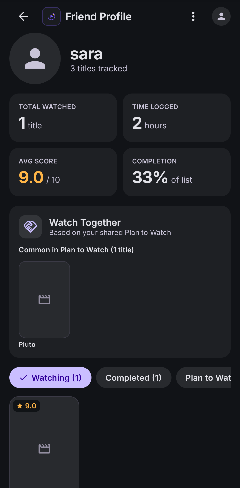
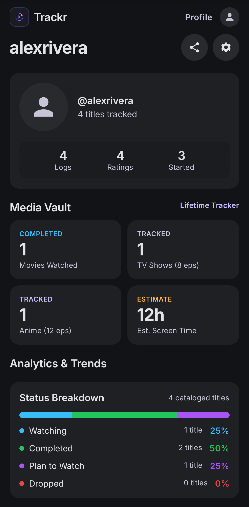

# Trackr

Trackr is an Android app for keeping track of the movies, TV shows and anime you watch, together with a small group of
friends. Log what you're watching, rate it, tick off episodes, and see what your friends are up to. Movies and TV come from
TMDB, anime from AniList, and everything syncs through Supabase, so your list works offline and follows you across devices.

Kotlin · Jetpack Compose (Material 3, "Cinematic Dark" from the Stitch design) · Hilt · Room · WorkManager ·
Supabase (Auth + Postgres/RLS) · TMDB (REST) · AniList (GraphQL).

## Screenshots
<p>
  
  
  
  
</p>
<p>
  
  
  
  
  
</p>

_Rendered headlessly with fake sample data (Robolectric + Roborazzi), so poster images appear as placeholders._

## Features
Google sign-in · Discover (continue watching, trending movies/TV/anime, airing this week) · Search with filters,
debounce and recent searches · Detail (trailer, cast, seasons, where to watch, related anime, more like this, friends who watched, rating/progress sheet) · My List (tabs, grid/list,
sort/filter, +1 episode, offline with last-write-wins sync) · Friends (add by username/invite code, requests, activity feed,
friend profiles, Watch Together) · Profile (stats, charts, invite code, theme, sign out, delete account) · Import from AniList, MyAnimeList and Letterboxd, export to JSON/CSV · "Up next" home-screen widget (airing this week, continue watching, +1) · Shared TMDB/AniList links open the title in Trackr · Year in review with a shareable image · Reactions and comments on friends' activity, recommend titles to friends · About with TMDB/AniList attribution.

## Setup
Requirements: JDK 17, Android SDK (platform 35, build-tools 35). `export ANDROID_HOME=/path/to/sdk`.

1. Create `local.properties` (gitignored) next to `settings.gradle.kts`:
   ```properties
   sdk.dir=/path/to/sdk
   TMDB_READ_TOKEN=<TMDB v4 read access token>
   SUPABASE_URL=https://<project-ref>.supabase.co
   SUPABASE_ANON_KEY=<anon/publishable key>
   GOOGLE_WEB_CLIENT_ID=<Google *Web* OAuth client id>
   ```
2. Supabase: apply `supabase/migrations/*.sql` in order, enable the **Google** provider (web client id + secret; leave
   *Skip nonce checks* off). `supabase/tests/rls_test.sql` verifies RLS (it ends with the intentional error `RLS_TESTS_PASSED`
   so everything it creates is rolled back).
3. Google Cloud: OAuth consent screen (Testing) with your friends' Gmail addresses as test users; a **Web** client
   (redirect `https://<project-ref>.supabase.co/auth/v1/callback`) and an **Android** client for package `com.trackr.app`
   with the SHA-1 of `trackr.keystore`:
   `keytool -list -v -keystore trackr.keystore -alias trackr` (current: `DA:E5:D0:52:C0:24:25:DF:A8:14:DD:B9:E8:FC:45:78:8F:5F:E1:40`).
4. Signing: `trackr.keystore` + `keystore.properties` (both gitignored) sign **debug and release** so the SHA-1 never changes.
   Keep a backup of the keystore – a new one means a new SHA-1 and an uninstall/reinstall.

## Build
```bash
./gradlew assembleDebug                 # debug APK
./gradlew testDebugUnitTest lintDebug   # 52 unit tests + lint
./gradlew assembleRelease               # app/build/outputs/apk/release/trackr-release.apk (R8 + resource shrinking)
adb install -r app/build/outputs/apk/release/trackr-release.apk   # or copy the APK to the phone and sideload
```
Visual check without a device: `./gradlew testDebugUnitTest -Proborazzi.test.record=true` renders the screens to
`app/build/outputs/roborazzi/*.png` (Robolectric) to compare with the Stitch screenshots.

## Known limitations
- **Never run on a real device/emulator by the author of this build** (headless VPS). Compile, unit tests, lint, R8 release build,
  signature and class-retention checks pass, and screens were rendered headlessly, but Google sign-in, the release build's runtime
  behaviour (R8) and network images should be smoke-tested on your phone first.
- Google sign-in needs `GOOGLE_WEB_CLIENT_ID` baked in at build time; without it the button reports "not configured".
- The TMDB token and Supabase anon key are embedded in the APK (normal for client apps; the anon key is protected by RLS). Only
  sideload to people you trust, and rotate the TMDB token if it leaks.
- Only Google accounts listed as OAuth test users can sign in while the consent screen is in *Testing* mode.
- Genre breakdown isn't shown (genres aren't stored in the list); the profile shows a status breakdown and rating distribution.
  Screen time is an estimate (movie 2h, TV 45 min/ep, anime 24 min/ep).
- Sync is pull-on-open/refresh + push after changes (WorkManager, needs network); there is no realtime. Activity "likes/comments",
  followers, notifications, email login and watchlist import from the Stitch mockups are not implemented (no backing feature).
- AniList is limited to ~80 requests/minute client-side; heavy browsing may briefly wait.
- Single-device-at-a-time editing is assumed; concurrent edits resolve last-write-wins by `updated_at` (device clocks matter).
